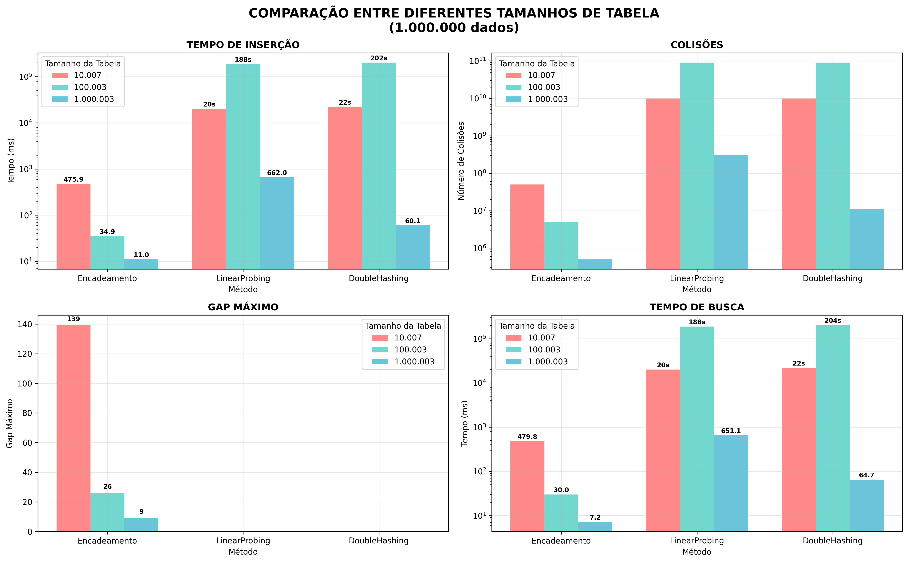
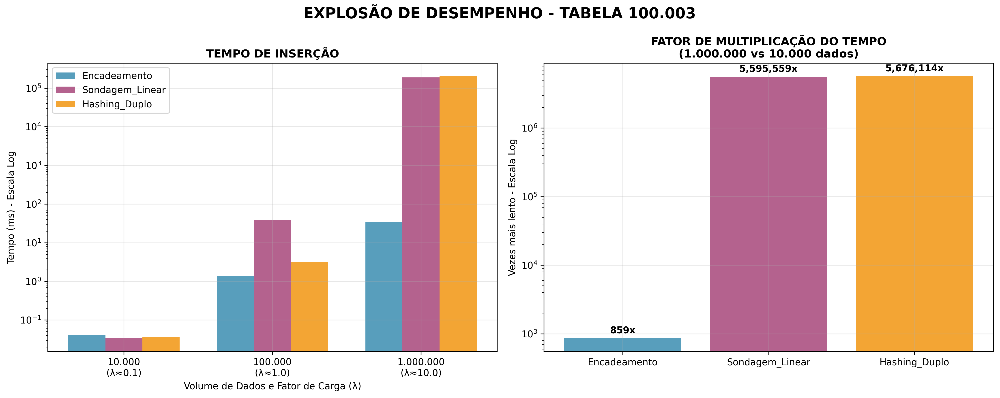
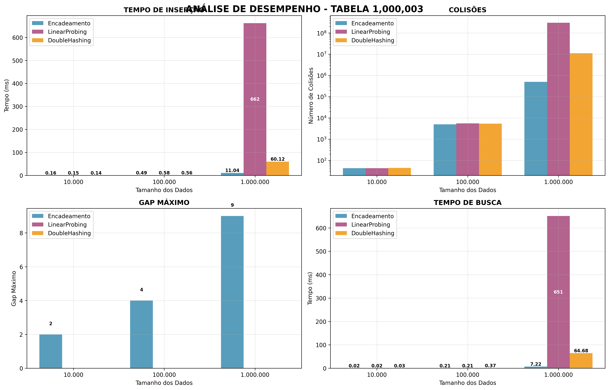
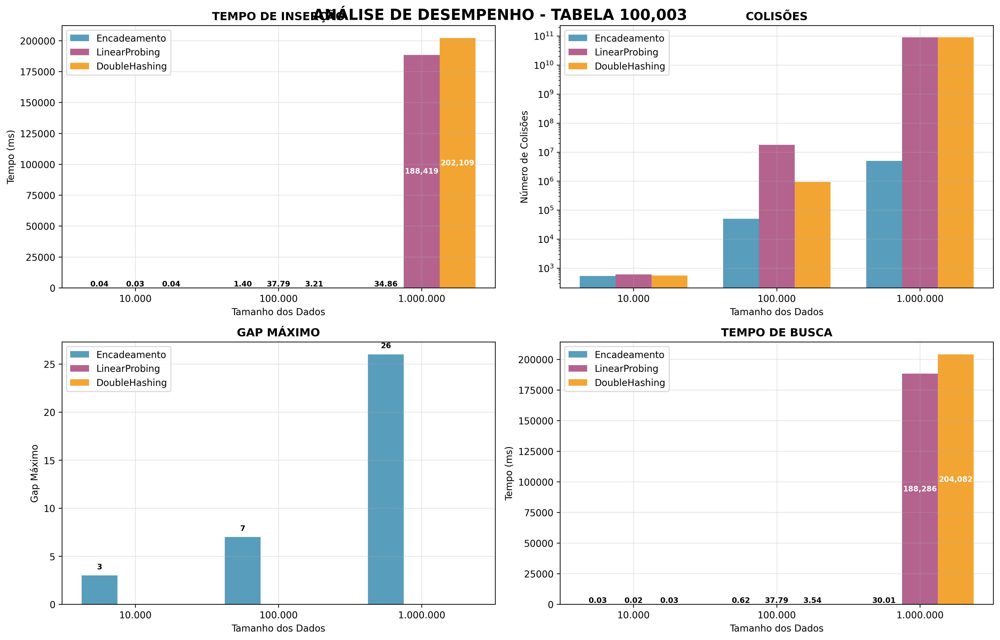
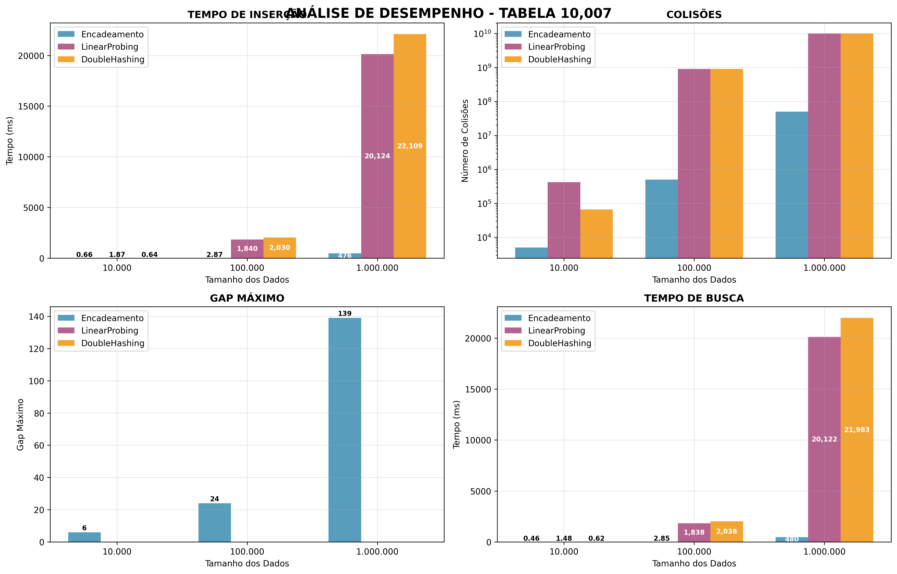

# Análise de Desempenho de Tabelas Hash

## 1. Visão Geral do Projeto

Este trabalho acadêmico, desenvolvido para a disciplina de Estrutura de Dados, tem como objetivo implementar e realizar uma análise comparativa de desempenho de três diferentes técnicas de tratamento de colisão em tabelas hash. As técnicas implementadas foram:

1.  **Encadeamento Separado:** Uma estratégia que utiliza listas encadeadas para armazenar múltiplos elementos que colidem no mesmo índice da tabela.
2.  **Endereçamento Aberto com Sondagem Linear:** Uma técnica de *rehashing* que, em caso de colisão, busca o próximo espaço livre na tabela de forma sequencial.
3.  **Endereçamento Aberto com Hashing Duplo:** Uma técnica de *rehashing* mais avançada que utiliza uma segunda função de hash para calcular o "passo" a ser dado na busca por um espaço livre, mitigando o problema de agrupamento.

O desempenho de cada abordagem foi medido em cenários variados de tamanho de tabela e volume de dados, analisando métricas como tempo de inserção, tempo de busca e número de colisões.

* **Autor:** Riscala Miguel Fadel Neto
* **Autor:** Victor Valerio Fadel
* **Autor:** Pedro senes velloso

## 2. Implementação e Metodologia

### 2.1. Estruturas Implementadas

O projeto foi desenvolvido em Java e estruturado nas seguintes classes:

* `Registro.java`: Classe que representa o objeto a ser armazenado, contendo um código (`int`) e um ponteiro para o próximo registro (utilizado no encadeamento).
* `HashEncadeamento.java`: Implementação da tabela hash com tratamento de colisão por encadeamento separado.
* `HashLinear.java`: Implementação da tabela hash com tratamento de colisão por sondagem linear.
* `HashDuplo.java`: Implementação da tabela hash com tratamento de colisão por hashing duplo.
* `Main.java`: Classe principal responsável por orquestrar os testes, gerar os dados, medir o desempenho e exportar os resultados para arquivos `.csv`.

### 2.2. Funções de Hash Utilizadas

* **Função de Hash Primária (Todos os Métodos):** Para o cálculo do índice inicial, foi utilizada a função de resto da divisão, uma escolha comum e eficiente.
    $$
    \text{hash}(chave) = chave \pmod{\text{tamanho}}
    $$

* **Função de Hash Secundária (Hashing Duplo):** Para o cálculo do passo no Hashing Duplo, foi utilizada a seguinte função, que garante que o passo nunca seja zero e seja relativamente primo ao tamanho da tabela (quando o tamanho é primo).
    $$
    \text{hash}_2(chave) = 1 + (chave \pmod{(\text{tamanho} - 1)})
    $$

### 2.3. Metodologia de Teste

Para garantir uma análise justa e abrangente, a seguinte metodologia foi adotada:

* **Tamanhos da Tabela Hash:** Foram escolhidos três tamanhos distintos, que são números primos para ajudar a minimizar colisões primárias:
    * `10.007`
    * `100.003`
    * `1.000.003`

* **Conjuntos de Dados:** Foram gerados três conjuntos de dados com códigos de registro aleatórios, utilizando uma **seed fixa (`Random(43)`)** para garantir que todas as estruturas fossem testadas exatamente com os mesmos dados, tornando a comparação válida.
    * `10.000` registros
    * `100.000` registros
    * `1.000.000` de registros

* **Métricas Coletadas:**
    * **Tempo de Inserção e Busca:** Medido em milissegundos (`ms`) para a operação completa no conjunto de dados.
    * **Número de Colisões:** Contabiliza o número de "passos" ou "sondagens" necessários para encontrar uma posição livre (na inserção) ou o elemento desejado (na busca).
    * **Maiores Listas (Encadeamento):** Os tamanhos das 3 maiores listas encadeadas.
    * **Análise de Gaps (Endereçamento Aberto):** O tamanho do menor, do maior e a média dos espaços vazios (`gaps`) entre os elementos na tabela.

## 3. Resultados e Análise

Os resultados completos dos testes foram exportados para os arquivos `resultado10007.csv`, `resultado100003.csv`, e `resultado1000003.csv`. Abaixo, uma análise dos cenários mais significativos.

### 3.1. Análise do Fator de Carga ($$\lambda$$)

O fator de carga ($$\lambda = \frac{\text{nº de itens}}{\text{tamanho da tabela}}$$) é o principal indicador de desempenho.

**Cenário 1: Baixo Fator de Carga ($$\lambda \approx 0.1$$)**
* **Tabela:** 100.003 | **Dados:** 10.000

| Método | Tempo Inserção (ms) | Tempo Busca (ms) | Colisões |
| :--- | :--- | :--- | :--- |
| Encadeamento | 0.040606 | 0.026720 | 537 |
| Linear Probing | 0.033673 | 0.018625 | 607 |
| Double Hashing | 0.035607 | 0.032912 | 557 |

**Análise:** Com a tabela "vazia", todos os métodos são extremamente rápidos e eficientes. O número de colisões é mínimo, e as diferenças de tempo são insignificantes.

**Cenário 2: Fator de Carga Próximo a 1 ($$\lambda \approx 1$$)**
* **Tabela:** 100.003 | **Dados:** 100.000

| Método | Tempo Inserção (ms) | Tempo Busca (ms) | Colisões |
| :--- | :--- | :--- | :--- |
| Encadeamento | 1.400685 | 0.623192 | 50.420 |
| Linear Probing | 37.793678 | 37.786949 | 17.850.445 |
| Double Hashing | 3.210379 | 3.538386 | 929.663 |

**Análise:** À medida que a tabela enche, as diferenças se tornam gritantes.
* **Sondagem Linear:** Sofre com o fenômeno de **agrupamento primário**. As colisões criam longos *clusters* de dados, fazendo com que o número de sondagens para encontrar um local livre dispare. Seu desempenho é o pior.
* **Hashing Duplo:** Por usar um passo variável, espalha melhor os dados e mitiga o agrupamento, resultando em um número de colisões e tempo muito menores que a Sondagem Linear.
* **Encadeamento:** Continua com um bom desempenho, pois o custo médio de inserção depende apenas do tamanho médio das listas (que aqui é próximo de 1).

**Cenário 3: Fator de Carga Extremo ($$\lambda \gg 1$$)**
* **Tabela:** 10.007 | **Dados:** 1.000.000 ($$\lambda \approx 100$$)

| Método | Tempo Inserção (ms) | Tempo Busca (ms) | Colisões |
| :--- | :--- | :--- | :--- |
| Encadeamento | 475.915009 | 479.770630 | 49.972.599 |
| Linear Probing | 20124.259766 | 20122.208984 | 9.907.632.507 |
| Double Hashing | 22109.380859 | 21982.962891 | 9.906.945.556 |

**Análise:**
* **Endereçamento Aberto (Linear e Duplo):** O desempenho entra em colapso total. Como o número de itens é muito maior que o tamanho da tabela, a tabela fica 100% cheia rapidamente. A partir daí, cada nova tentativa de inserção percorre a tabela inteira em busca de um espaço que não existe. Os tempos de inserção (20-22 segundos) e o número de colisões (na casa dos 9.9 bilhões) refletem essa busca inútil.
* **Encadeamento Separado:** É a **única abordagem viável** neste cenário. O tempo de inserção e busca aumenta, pois as listas encadeadas se tornam longas (a maior lista chegou a 141 elementos), mas o sistema continua funcional.

### 3.2. Gráficos Comparativos (Exemplos)

Para uma visualização clara, gráficos são essenciais. Abaixo estão os dados para a construção de um gráfico comparativo de **Tempo de Inserção** para a tabela de **100.003**, que ilustra bem o impacto do fator de carga.

**Tempo de Inserção (ms) vs. Volume de Dados (Tabela de 100.003)**

| Volume de Dados | Encadeamento | Sondagem Linear | Hashing Duplo |
| :--- | :--- | :--- | :--- |
| 10.000 | 0.04 | 0.03 | 0.03 |
| 100.000 | 1.40 | 37.79 | 3.21 |
| 1.000.000 | 34.86 | 188419.26 | 202109.40 |

*(Um gráfico de barras com esses dados mostraria visualmente a explosão no tempo para as técnicas de endereçamento aberto em alta carga.)*

## Comparação Entre Tabelas



## Explosão de Desempenho



## tabela 1000003



## tabela 100003



## tabela 10007



## 4. Conclusão

Com base na análise dos dados, as seguintes conclusões podem ser tiradas:

1.  **Melhor Desempenho Geral (Endereçamento Aberto):** O **Hashing Duplo** é superior à Sondagem Linear em todos os cenários com fator de carga moderado a alto ($$\lambda > 0.5$$), pois evita o problema de agrupamento primário, mantendo o número de colisões e o tempo de operação significativamente mais baixos.

2.  **Melhor para Cenários Imprevisíveis:** O **Encadeamento Separado** é a técnica mais robusta. Seu desempenho degrada de forma muito mais suave com o aumento do fator de carga e, crucialmente, é a única das três que continua a funcionar de forma eficiente quando o número de elementos excede o tamanho da tabela.

3.  **Pior Desempenho:** A **Sondagem Linear** é a abordagem menos eficiente, exceto em tabelas com baixíssimo fator de carga. Sua simplicidade não compensa a severa degradação de desempenho causada pelo agrupamento primário assim que a tabela começa a encher.

Em suma, a escolha da técnica ideal depende diretamente da aplicação. Para sistemas onde o número máximo de elementos é conhecido e é possível garantir um fator de carga baixo ($$\lambda < 0.7$$), o Hashing Duplo é uma excelente escolha. Para sistemas onde o volume de dados pode crescer indefinidamente ou exceder a capacidade inicial da tabela, o Encadeamento Separado é a única opção confiável.

## 5. Como Executar o Projeto

1.  Clone o repositório.
2.  Certifique-se de ter o JDK (Java Development Kit) instalado.
3.  Navegue até a pasta do projeto e compile todos os arquivos `.java`:
    ```bash
    javac *.java
    ```
4.  Execute a classe principal:
    ```bash
    java Main
    ```
5.  Ao final da execução, os resultados serão gerados em três arquivos: `resultado10007.csv`, `resultado100003.csv` e `resultado1000003.csv`.
